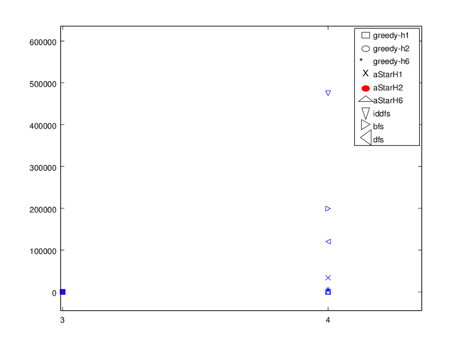

% SIA- TP1- 
%  GRUPO7: Juan Pablo Rey, Santiago Camisay, Fernando Bejarano. 

\newpage

# Problema asignado: CalcuDoku

El juego Calcudoku es una versión modificada del juego Sudoku. En el mismo se cuenta con un tablero de N por N casilleros. Dentro de este juego se tiene grupos, los cuales son conjuntos de casilleros  junto con una operación matemática que, aplicada a dichos casilleros, debe dar un resultado definido por el mismo.

Además, también incluye las reglas propias del Sudoku original: 

+ los números con los que se puede completar el tablero son del 1 al N inclusive.
+ no se puede repetir el mismo número por fila ni columna.

# Llenado del tablero

El tablero del juego se resuelve con la técnica "reparación heurística": se empieza con el tablero lleno y luego se procede a intercambiar valores entre casilleros hasta obtener un tablero que cumpla todas las reglas del problema.
En linea con esta técnica, se llena todo el tablero de la siguiente manera: por cada fila se toman los números del 1 al N inclusive y luego se los mezcla en forma aleatoria. De esta manera se logra cumplir la restricción de que cada fila no tenga repetidos; el objetivo de esto es simplificar el problema y disminuir la cantidad de estados que se tienen que analizar por los distintos algoritmos. Al hacer esto último, el problema se reduce a intercambiar los valores de los casilleros dentro de una misma fila.

# Heurísticas (función h):

En las siguientes heurísticas, "G" representa la cantidad de grupos que no cumplen la restricción de permitir obtener el resultado al aplicar el operador de dicho grupo sobre los números de los casilleros de dicho grupo. 
Por otra parte, "C" representa la cantidad de columnas que no cumplen la restricción de no tener elementos repetidos. 
Debido a la manera en la que se resuelve el problema, se garantiza que por fila no haya repetidos y entonces no es necesario considerar que las filas tengan valores repetidos.

## Admisibles
Las siguientes heuríticas fueron probadas con tableros de hasta 5 por 5 casilleros.

### H1

La heurística consiste en la siguiente ecuación:  
$$ H1=\left \lceil{ \frac{\max (G,C)}{2}  }\right \rceil $$

La idea detrás de esta heurística es estimar la cantidad de intercambios entre casilleros considerando cual de los parámetros (G o C) presenta una mayor cantidad de elementos incorrectos. Esto se obtiene mediante la función "máximo". 
Luego a este valor máximo, se lo divide por dos debido a lo siguiente:

+ Caso de que el valor máximo sea C: en el caso la cantidad de columnas incorrectas se da en cantidades pares  luego las misma cantidad de intercambios que soluciona a una columna también soluciona a otra. Para los casos en los que esta cantidad no sea multiple de dos, si se la divide por dos y se le calcula la función techo, se obtiene una cantidad menor o igual a la cantidad de pasos necesarios para solucionar el tablero
+ En el caso en el que el valor máximo sea G: dado que se debe subestimar la cantidad de intercambios que faltan, entonces se estima este valor considerando que con un intercambio se solucionan dos grupos a la vez.

### H2 
La heurística consiste en la siguiente fórmula:  

$$ H2=\left \lceil{ \frac{C + G}{2} * \frac{1}{2} }\right \rceil =\left \lceil{ \frac{C + G}{4}  }\right \rceil
 $$

Esta fórmula se obtiene calculando el promedio entre G y C; y luego dividiendo este resultado por dos. Al dividir este promedio, se obtiene una cantidad menor o igual a la cantidad real de pasos que faltan para obtener la solución.

## No admisibles 
Para el caso de tableros de 6 por 6 casilleros o superiores, no se logro llegar a la solución del tablero con las heurísticas anteriores debido a las restricciones de hardware y la capacidad de procesamiento disponibles en las computadoras utilizadas por el equipo durante la etapa de desarrollo. Debido a esto se decidió emplear la siguiente heurística para solucionar este inconveniente.

### H6.
La fórmula de esta heurística es la siguiente:

$$ \sum_{i=1}^{cantidadGrupos} \frac {\left | resultadoEsperado_i - resultado_i \right |}{2N} $$
La lógica de esta herística consiste en tomar cada grupo que no sea correcto para los casos en los que la operación sea una suma, una resta o ;luego se evaluar cuánto da la operación de dicho grupo. Con este valor pueden ocurrir dos posibilidades: se obtiene un resultado menor o mayor al resultado para ese grupo. En ambos casos,  se calcula la diferencia entre lo que debería dar y lo que realmente da, luego se lo divide por el máximo valor que puede contener dicho grupo (N). La idea detrás de esto es estimar la cantidad de intercambios que faltan dentro del grupo en cuestión.
Por último, se suman estas estimaciones para todos los grupos y se la divide por dos ya que se asume que cada intercambio puede llegar a arreglar dos grupos a la vez.
Esta heurística no es admisible ya que sobrestima la cantidad de pasos que faltan según se analizó en multiples casos de prueba. 

# Estructuras de datos implementados en el problema

## Estructura de un estado (CalcudokuState)

### Tablero (Board.java)
Contiene los grupos, los valores de los casilleros y el parámetro N. 
Los valores están implementados en un BitSet para poder manipular los datos lo más rápido posible. 
La lista de grupos es de tipo "final" en Java y no se copia cuando se copian los estados. La razón de esto es porque los grupos pertenecen a la estructura inmutable del juego y no tiene sentido copiarlos por deep copy sino más bien compartirlos.

### Grupo (Group.java)
Están compuestos por una lista de posiciones, un operador y el resultado que se espera de aplicar dicho operador a los elementos en las posiciones determinadas por la lista.
 
### Posición (Position.java)
Par ordenado que representa un casillero contiene una componente para la columna y otra para la fila

### Operador (Operator.java)
Pueden ser: 

+ MINUS: admite más de un casillero y el resultado es restarle al más grande de los elementos del grupo el resto de los elementos.
+ PLUS: admite más de un casillero y el resultado es la suma de todos los elementos del grupo.
+ MULTIPLY: admite más de un elemento y el resultado es el producto de todos los elementos del grupo.
+ DIVIDE: admite solo dos elementos y el resultado es la división entre ambos.
+ IDENTITY: admite un sólo elemento determinado por el valor del resultado.

# Reglas

Se cuenta con un esquema de reglas que genera todos los intercambios posibles que se pueden hacer dentro de cada fila del tablero. Siendo este de NxN = m elementos, se dedujo que la cantidad de intercambios posibles representa un grafo completo de m nodos siendo las aristas los intercambios. Por lo tanto tenemos m(m-1)/2 intercambios posibles. Los mismos son representados por una lista de posiciones.

# Benchmarks.

Para realizar las pruebas de rendimiento que se encuentran a continuación se tomaron 3 ejemplos de tableros para cada N, y se realizaron 5 corridas por cada combinación de estrategia de búsqueda con cada una de las  heurísticas (para el caso de IDDFS, BFS, y DFS no se emplea heurística según se vio en clase). Estos ejemplos fueron obtenidos de [3] y se encuentran en el directorio "src/test/resources" dentro del repositorio.

Los gráficos y los valores de las pruebas se encuentran en el anexo. En los mismos se puede apreciar que para el caso de tableros de 3 por 3 hay una diferencia entre los algoritmos a favor de H1 y H2.
Por otra parte, para el caso 4x4 se puede ver lo siguiente:

+ para Greedy: H1 y H2 resolvieron expandiendo menor cantidad de nodos.
+ para A estrella: se expandieron menos nodos con la heurística H1.

En todos los casos de algoritmos informados, se obtuvieron mejores resultados que en los desinformados( dfs, bfs,iddfs).

# Conclusiones

Para la solución de este problema, se obtienen mejores resultados utilizando heurísticas. Hasta tableros de 5x5 la mejor heurística es H1. Para tableros mayores es necesario usar H6 que no es admisible, pero permite llegar a un resultado sin que el programa se quede sin memoria.
\newpage

# Anexo
##Gráfico de benchmarks

\newpage

##Datos del benchmark
###Caso 3 por 3 (cantidad de nodos explotados)
greedy_h1:4  
greedy_h2=7  
greedy_h6=53  
a_star_h1=22  
a_star_h2=31  
a_star_h6=66  
iddfs=278  
bfs=107  
dfs=130  

###Caso 4 por 4. (cantidad de nodos explotados)

greedy_h1=115  
greedy_h2=98  
greedy_h6=5999  
a_star_h1=33935  
a_star_h2=47696  
a_star_h6=78973  
iddfs=475128  
bfs=199305  
dfs=120359  

# Bibliografía.

+ [1] http://www.conceptispuzzles.com/index.aspx?uri=puzzle/calcudoku/rules
+ [2] https://es.wikipedia.org/wiki/Kenken
+ [3] http://www.kenkenpuzzle.com

